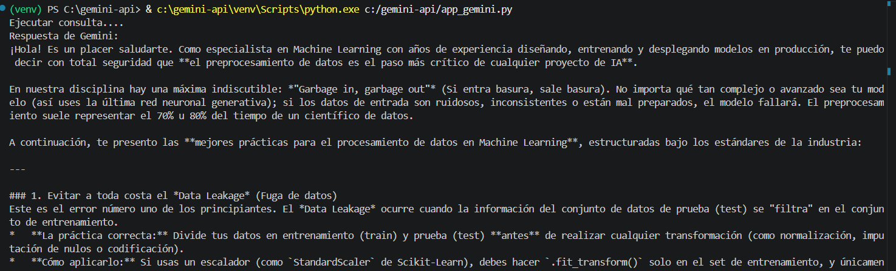

# Conexión a la API de Gemini (Python)

Este repositorio contiene un script en Python diseñado para conectarse a la API de Gemini utilizando el SDK oficial de Google GenAI (google-genai). El script toma el historial de una conversación de soporte técnico, la procesa y utiliza el modelo gemini-3.5-flash para generar un resumen inteligente estructurado.

## Requisitos Previos

Antes de ejecutar el proyecto, asegúrate de tener instalado lo siguiente en tu sistema:

* Python 3.10 o superior
* Una clave de API de Gemini (Gemini API Key). Puedes obtenerla desde Google AI Studio.

## Estructura del Proyecto

El proyecto debe mantener la siguiente estructura básica de archivos:

gemini-api-connection/
│
├── img/
│   └── evidencia.png     # Captura de pantalla de la terminal
├── .env                  # Archivo opcional con las credenciales de la API
├── .gitignore            # Archivo para evitar subir credenciales a GitHub
├── README.md             # Instrucciones de uso del repositorio
└── app_gemini.py               # Código fuente principal en Python

## Instrucciones del Proyecto 
   
1. Instalar las dependencias 
Este proyecto requiere paquetes externos que no vienen incluidos por defecto en la instalación estándar de Python. Ejecuta el siguiente comando para instalarlos junto con todas sus dependencias secundarias necesarias (como requests):

   pip install google-genai==2.8.0 python-dotenv==1.2.2

   * google-genai (v2.8.0): SDK oficial de Google para realizar la comunicación, autenticación y manejo de modelos de IA Generativa.
   * python-dotenv (v1.2.2): Librería encargada de parsear e inyectar configuraciones desde archivos de entorno de manera interna.

2. Configurar la Variable de Entorno (Obligatorio)
Para que el script funcione correctamente y autentique de forma segura con Google, se debe cargar la clave de la API en el entorno del sistema antes de lanzar la aplicación.

Dependiendo de la terminal que estés utilizando en Windows, ejecuta el comando correspondiente antes de correr el script:

   * En PowerShell (Recomendado / Terminal por defecto de VS Code):
     $env:GEMINI_API_KEY="TU_API_KEY_AQUÍ"

    Reemplaza "TU_API_KEY_AQUÍ" por tu credencial real obtenida en Google AI Studio. Este paso es obligatorio.

## Ejecución del Código

Una vez configuradas las dependencias y la variable de entorno, ejecuta el script principal desde la terminal:

python app_gemini.py

### Flujo de Operación del Script
1. El programa inicializa el entorno de configuración mediante load_dotenv().
2. Extrae de forma segura la clave almacenada en el sistema local utilizando os.getenv("GEMINI_API_KEY").
3. Establece comunicación mediante la clase genai.Client.
4. Envía una consulta predefinida al modelo de lenguaje y muestra por consola la respuesta estructurada o el registro detallado en caso de error.

## Evidencia de Ejecución

A continuación se muestra la captura de pantalla de la terminal al ejecutar el script de manera exitosa:

